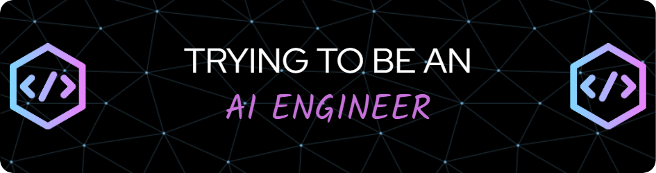

<h1 align="center">Hey fellas 👋, I'm Akkiyolo</h1>
<h3 align="center">🚀 Passionate Aspiring AI Engineer | Developer | Learner</h3>

  

---

  

  

---

## 🧠 About Me

- 🌱 Currently learning **Machine Learning, Deep Learning, and NLP**
- 🔭 Working on AI-based projects involving **Python, TensorFlow, and OpenCV**
- 💻 All my projects: [My Portfolio Website](https://akkiyolo.vercel.app/)
- ✍️ Exploring the world of blogging & AI research
- 📫 Reach me at: **akshatshukla069@gmail.com**

---

## 🌐 Connect with Me

  
  
  

---

## 🛠️ Languages & Tools

  
  
  
  
  
  
  
  
  
  
  
  
  
  

---

## 📊 GitHub Stats

  
  
  

---

<picture>
  <source media="(prefers-color-scheme: dark)" srcset="https://raw.githubusercontent.com/akkiyolo/akkiyolo/output/github-snake-dark.svg" />
  <source media="(prefers-color-scheme: light)" srcset="https://raw.githubusercontent.com/akkiyolo/akkiyolo/output/github-snake.svg" />
  
</picture>

## 🚀 AI Projects

- 🤖 Face Detection for Drowsiness using OpenCV & Dlib  
- 🧠 Whatsapp agent for automated defense news updates for my channel
- 🗣️ VITB Nexis a full stack website for latest campus updates with recommendation system
- 🔍 WikiGalaxy an ai agent that will provide you any kind of info in a summarised manner using wikipedia api
*(More on [Portfolio](https://akkionweb.netlify.app/))*

---

## ✍️ Featured Blogs

- Coming soon... 

---

*“The future belongs to those who learn more skills and combine them in creative ways.” – Robert Greene*

